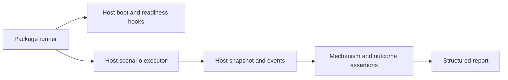

# Adopt the AutoTest package

Use when adding `com.hung.autotest` to a host game. API overview: [package README](../../README.md). To execute an authored case through Unity MCP, use [run from the agent](run-from-agent.md).

## Keep meaning in host glue

The package owns reusable runner lifecycle, capabilities, neutral assertions, snapshots and reports. The host owns scenarios, gameplay observations, semantic input targets and product assertions. Keep host glue in a separate assembly; production gameplay must not depend upward on test glue. Make development/editor build constraints deliberate and verify them in the host assembly definition.

Register host factories before a run:

- `AutoTestRunner.ExecutorFactory` for `IAutoTestScenarioExecutor`.
- `AutoTestRunner.SnapshotBuilderFactory` for `IRuntimeSnapshotBuilder`.
- `AutoTestEventCollector.EventSourceFactory` for host events.
- Host assertion creators through `AutoTestAssertionRegistry`.
- `AutoTestBootstrapper.ExtraReadyCheck`, `BootKick` and, where needed, `HostBootReset`.

Readiness must allow boot to progress. Do not require level construction before the boot kick that constructs that level. Later scenario readiness belongs in the executor. Reset logical-run state at the package's run boundary, not merely in a component's `Awake`.

## Capabilities, input and snapshots

Declare required capabilities before execution. Missing capability is a setup failure, not an assumed success. Optional `Hung.AutoTest.FakeInput` requires the appropriate input/UI dependencies; capability availability alone does not prove a gesture hit the intended target.

Host snapshot extensions use host-owned serializable DTOs, stable unique IDs and deterministic ordering. Keep malformed/missing extension handling explicit. Assertions can prove only what snapshots and events observe. Restore fake devices, gestures, subscriptions and scenario state during cleanup, including partial failure.

## Run and inspect evidence

Create or find the `AutoTestRunner` object and trigger `SetSingleCase` plus `RunConfiguredSingleCase`, or `SetSuite` plus `RunConfiguredSuite`. For a host that needs arming before play, follow its documented arm step; enter play once and trigger immediately rather than waiting for boot first.

Read the run's JSON report and per-case failures/final snapshots. Do not infer success from runner completion, a scenario callback, or a final state that setup already supplied. Assert both the decisive mechanism and its outcome.

For custom built-player orchestration, the host can register `AutoTestPlayerEntrypoint.ExternalRunner`; the host documents its scenario flags, terminal result and exit-code mapping. Keep artifacts tied to run identity, package graph, build and platform. Redact sensitive command-line values and distinguish Editor evidence from built-player evidence.

## Verify adoption

Test boot/readiness and reset ordering, capability rejection before prepare, cleanup after partial failure, unknown assertion IDs, extension serialization, real input effect and terminal report ownership. Re-run representative current cases when the package graph or host glue changes. A green case does not establish coverage for unrelated features.
