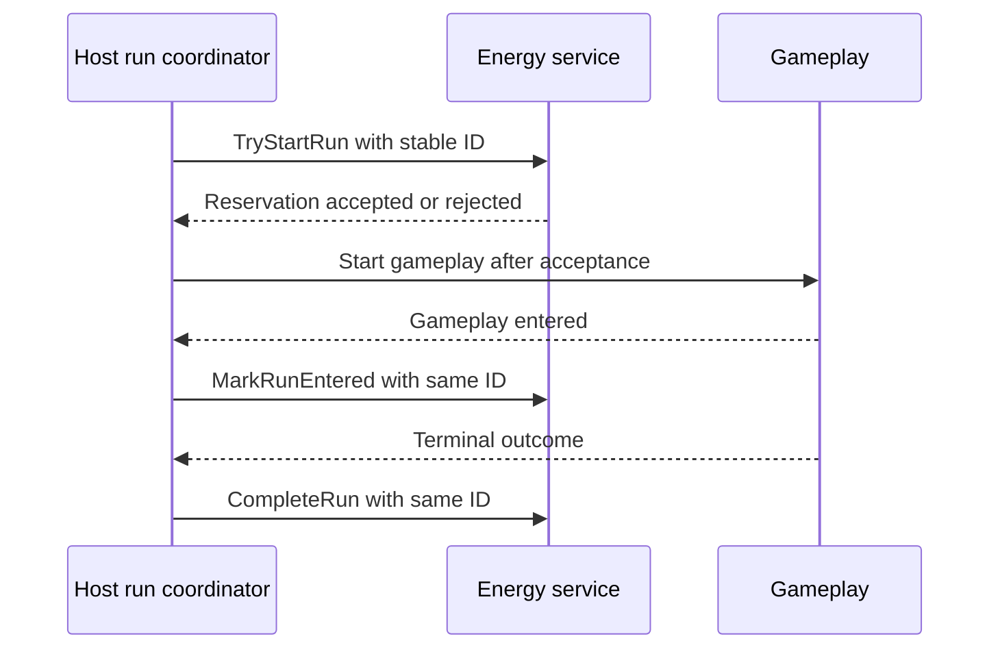

# Adopt the Energy package

Use when composing `com.hung.liveops.energy` into a host game. API overview: [package README](../../README.md). The package owns energy semantics and local state; the host owns gameplay timing, service publication and presentation.

## Compose and fail closed

Supply an `EnergyConfigSO`, host-chosen state-file path and clock to `EnergyServiceFactory.CreateLocal`. Check the creation result before publishing `IEnergyService`. Invalid configuration or failed creation must block energy-dependent gameplay rather than inventing free or unlimited energy.

Subscribe presentation to `Current` snapshots and `Changed`. Route mutations through the service; do not edit state files or mirrored balances directly. The package has no internal Unity timer: the host supplies a `Reconcile` cadence and appropriate lifecycle reconciliation.

## Preserve one run identity

Recover the persisted `Current.ActiveRun` identity after restart. Generate a new identity only for a genuinely new run; reuse it for retries and recovery.

`TryStartRun` reserves energy before loading gameplay. Call `MarkRunEntered` only once gameplay truly entered. After entry, finish through `CompleteRun` with the real `RunOutcome`. Use `CancelFailedStart` only before entry; it restores the exact reservation sources. Clear host run identity only after an accepted result, retaining it for persistence-failure retries.

## Persistence, reconcile and failure

Mutations use copy-on-write and save before publishing state or `Changed`. Persistence failure leaves old state intact. Same-command replay is distinct from conflicting reuse of an identity; do not generate a new identity to bypass a failed retry.

Reconcile applies whole regeneration intervals, preserves remainder, honors caps and Unlimited expiry, handles rollback without granting time-derived progress, and settles prior configuration before adopting a changed one. Local wall-clock handling does not establish server authority.

Corrupt-state handling retains quarantine evidence and can seed fresh local state. Verify the selected implementation's policy before relying on recovery as entitlement restoration. A local reset is not a server restore.

## Verify adoption

Exercise insufficient energy, renewable/bonus reservation, Unlimited, failed start before entry, terminal outcomes after entry, persistence failure/retry, duplicate/conflicting commands, process restart with an active run, corruption, rollback and configuration changes. Verify every terminal gameplay path reaches the coordinator and UI only reflects service state. Record current package version, configuration and Editor/player evidence separately.
