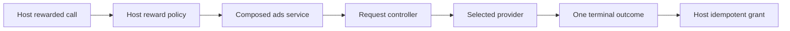

# Adopt the Ads package

Use when composing `com.hung.services.ads` into a host game. API overview: [package README](../../README.md). This playbook defines reusable integration steps; the host owns its placements, reward policy and proof artifacts.

## Choose one composition owner

Keep neutral orchestration in `Hung.Ads`. Select the vendor integration and installed SDK deliberately; optional adapter assemblies are not proof that a provider is configured. The neutral and IronSource integration both have an `AdsManager` type, so identify the assembly and namespace when wiring one. Do not publish two competing owners of the host ads service.

For routed providers, follow the README's routed-mode configuration and inspect the current routing setup. Decide whether it replaces or coexists with an existing mediation owner before enabling it. Installing a newer package does not make routing adopted.

## Wire the host boundary

1. Supply provider components and platform configuration; verify serialized references in the Editor.
2. Publish the composed `IAdsService` through the host service boundary before callers use it.
3. Use `AdsShowRequest` and terminal `AdsShowResult` where the caller supports them. Legacy callback callers must still obey request terminality.
4. Keep unavailable-inventory fallback in host glue. Denying, granting a free reward, or invoking only a close continuation changes game economy and must be chosen per placement.
5. Give durable reward grants their own idempotency identity. Ad callback deduplication does not make an arbitrary economy callback durable.

## Pause and revenue ownership

Provider-backed rewarded/interstitial paths use the Ads pause lease through the pause service. Terminal handling releases that lease, leaving unrelated pause reasons intact. Do not reset global time scale from an ad close callback. Verify unavailable and misconfigured paths do not leak leases.

Compose analytics and its revenue sink before provider impression callbacks can run. Pass neutral revenue fields to that sink; vendor analytics dependencies stay in integration adapters. Identify the actual SDK owner rather than relying on a similarly named manager.

## Verify adoption

- Inspect provider wiring and the single service owner.
- Exercise availability, reward, close, failure and duplicate/late callbacks.
- Exercise background/resume and concurrent non-ad pause reasons.
- Confirm the load queue advances and missing providers fail rather than crash.
- Capture current test-device or sandbox artifacts for mediation and revenue callbacks. Editor fallback behavior does not establish device SDK behavior or production fill.

Record package version, build, platform, provider configuration, placement, request identity and evidence path. Distinguish source wiring, unit tests, Editor proof and device proof.
