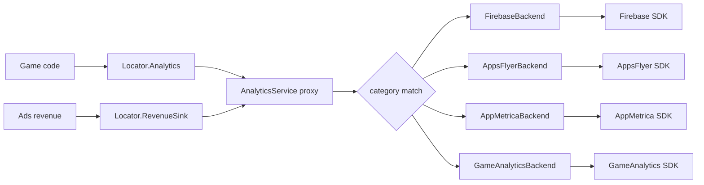
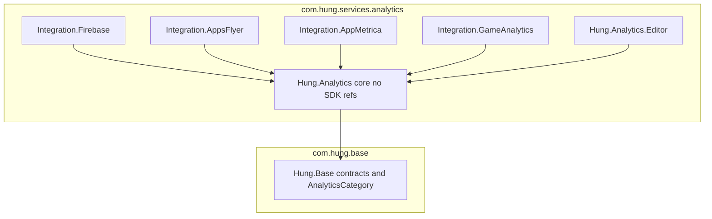

# Hung Services Analytics

One analytics proxy (`Locator.Analytics`) that fans every tracked event out to any combination of Firebase, AppsFlyer, AppMetrica and GameAnalytics. Each backend is switchable at build time by a scripting define and at edit time by `Hung/Analytics/Settings`.

Contracts (`IAnalyticsService`, `IRevenueEventSink`, `AnalyticsCategory`, Locator slots) live in `com.hung.base` `Runtime/Services/Contracts`. Game code only ever calls `Locator.Analytics`.

## Install

1. Import the SDKs you want (Firebase, AppsFlyer, AppMetrica, GameAnalytics). The GameAnalytics SDK ships as plain source with no asmdef, so the project adds `Assets/GameAnalytics/Plugins/Scripts/GameAnalyticsSDK.asmdef`; re-add it after re-importing the SDK. Enter GameAnalytics game/secret keys in `Window/GameAnalytics/Select Settings`.
2. Open `Hung/Analytics/Settings`. It creates `Assets/Resources/HungAnalyticsSettings.asset` with one row per backend.
3. Per row: tick **enabled**, choose the **categories** it receives, enter keys (AppsFlyer: dev key + iOS app id; AppMetrica: API key; Firebase and GameAnalytics need no key here).
4. Press **Apply scripting defines**. It writes one `HUNG_ANALYTICS_<ID>` define per enabled row for Android, iOS and Standalone, and Unity recompiles.
5. To truly strip a backend from a build, delete its SDK folder from `Assets/`. A define off only removes our adapter code; the SDK's native libraries still ship while its folder exists. The window warns about this.

A backend whose SDK is missing cannot be enabled (red box, Apply blocked). A backend whose key is empty is dropped at startup with one error log; the game and the other backends keep working.

## Architecture

Startup: each integration assembly registers its backend with `AnalyticsBackends` at `AfterAssembliesLoaded`; `AnalyticsBootstrap` (`BeforeSceneLoad`) reads the settings asset, initializes every registered backend, keeps the ones that initialize, builds one `AnalyticsService` and assigns `Locator.Analytics` and `Locator.RevenueSink`. No prefab is needed. With zero backends the locator still holds a no-op proxy.

## Categories

| Category | Proxy methods | Default subscribers |
|---|---|---|
| `Ads` | ad funnel, first ads session | Firebase, GameAnalytics |
| `Product` | IAP, level pass | Firebase, AppsFlyer, AppMetrica, GameAnalytics |
| `Design` | tutorial, currency, level start/fail/stars, custom GD events | Firebase, GameAnalytics |
| `Revenue` | ad impression revenue | Firebase, AppsFlyer |

AppMetrica defaults to `Product` only: its plugin already auto-tracks MAX and IronSource ad revenue (`APPMETRICA_FEATURES_ADREVENUE_*` defines), so routing `Revenue` too would double-count. The settings window warns if you turn it on while those defines exist. `AnalyticsCategory` numeric values are serialized in the settings asset: never renumber.

## Public API index

| Type | Assembly | One line |
|---|---|---|
| `AnalyticsCategory` (com.hung.base) | `Hung.Base` | `[Flags]` routing tag: None, Ads, Product, Design, Revenue, All |
| `IAnalyticsService` (com.hung.base) | `Hung.Base` | Game-facing contract behind `Locator.Analytics` |
| `IAnalyticsBackend` | `Hung.Analytics` | What an SDK adapter implements: Initialize, LogEvent, SetUserProperty, LogAdRevenue |
| `AnalyticsService` | `Hung.Analytics` | The proxy; implements `IAnalyticsService` and `IRevenueEventSink`, isolates backend exceptions |
| `AnalyticsBackends` | `Hung.Analytics` | Static registry integration assemblies add themselves to |
| `AnalyticsSettings` | `Hung.Analytics` | ScriptableObject at `Resources/HungAnalyticsSettings`: debugLog + one entry per backend |
| `AnalyticsBackendEntry` | `Hung.Analytics` | Per-backend row: id, enabled, categories, apiKey, appId; default routing |
| `AnalyticsBackendIds` | `Hung.Analytics` | Backend id constants, define names, define rewrite |
| `AnalyticsBootstrap` | `Hung.Analytics` | Composition root; `Install(settings, backends)` is the testable seam |
| `AnalyticsText` | `Hung.Analytics` | Culture-invariant helpers: name sanitizing, value strings, flat JSON |
| `RecordingAnalyticsBackend` | `Hung.Analytics` | Test double backend; records events, can be told to throw |
| `RecordedEvent`, `RecordedRevenue` | `Hung.Analytics` | Records captured by the test double |
| `AnalyticsSettingsWindow` | `Hung.Analytics.Editor` | `Hung/Analytics/Settings`: switches, keys, Apply defines |
| `FirebaseBackend` | `Hung.Analytics.Integration.Firebase` | Firebase Analytics + Messaging, queues events until Firebase is ready (cap 100) |
| `FirebaseRemoteConfigCache` | `Hung.Analytics.Integration.Firebase` | Non-blocking Remote Config: `IsReady`, `Fetched`, `TryGetString/Long/Double/Bool` |
| `AppsFlyerBackend` | `Hung.Analytics.Integration.AppsFlyer` | Inits AppsFlyer from settings, mediation-aware ad revenue |
| `AppMetricaBackend` | `Hung.Analytics.Integration.AppMetrica` | Activates AppMetrica from settings, JSON event params |
| `GameAnalyticsBackend` | `Hung.Analytics.Integration.GameAnalytics` | Every event becomes a design event; keys live in GA's own settings; user properties and revenue are no-ops |

Backend C# namespace is `Hung.Analytics.Backends`. Never name a namespace segment `Firebase`: it shadows the SDK's root `Firebase` namespace.

## Adding a GD event

- One-off: `Locator.Analytics.LogEvent("event_name", AnalyticsCategory.Design, parameters)`. No backend changes.
- Worth a name: add a method to `IAnalyticsService` (base), implement it in `AnalyticsService` with its category, and add a name test to `AnalyticsServiceTests`.

Event names of existing methods are byte-identical to the 0.3.x Firebase names so dashboards keep working, except FAIL (now `level_{n}_fail` / `ftu_level_{n}_fail`). Firebase sanitizes names to `[A-Za-z0-9_]`, letter start, 40 chars, so a GD name with spaces or a leading digit is still delivered.

Level pass state belongs to save data: on COMPLETE call `GameData.level.MarkPassed(level)` and pass its result as `firstPass` to `LevelTrackEvent`.

## Tracking (message space)

Game code sends facts; rules turn them into events. Design: `.cursor/plans/analytics-message-space-design.md`, map of every message: `.cursor/plans/analytics-message-space-atlas.md`.

    AnalyticsTracking.Facts.StageStart(12, replay: false);
    AnalyticsTracking.Facts.WaveReached(5);
    AnalyticsTracking.Facts.StageEnd(StageResult.Fail);
    AnalyticsTracking.Facts.Feature("skill_pick", ("skill_id", "fire_ring")); // id must be in TrackingSettings.featureEvents
    AnalyticsTracking.Register(new MyGameRule());                           // before the first frame

| Type | Assembly | One line |
|---|---|---|
| `AnalyticsTracking` | `Hung.Analytics` | Static entry: `Facts` (never null) and `Register(IRule)` |
| `TrackingFacts` | `Hung.Analytics` | Fact API: StageStart, WaveReached, StageEnd, Progress, Gacha, Feature, Tutorial |
| `Fact`, `FactKind`, `StageResult`, `MonetizeKind`, `TutorialPhase` | `Hung.Analytics` | Immutable fact and its enums |
| `IRule` | `Hung.Analytics` | Rule contract: `Declare` events, handle `OnFact` |
| `TrackingContext` | `Hung.Analytics` | FTU, stage, wave, replay, attempt, focus, away time, install day, state |
| `TrackingPipeline` | `Hung.Analytics` | Queues facts until Start, runs context and rules, isolates failures, saves at ColdStart/Blur/StageEnd |
| `EventEmitter` | `Hung.Analytics` | ftu_ prefix, A/B mode, 40-char fallback, B-name budget; all events Design |
| `TrackingSettings`, `OutputMode`, `ModeOverride` | `Hung.Analytics` | Optional asset `Resources/HungTrackingSettings`: thresholds, modes, feature list |
| `Counter`, `Since`, `Accum`, `Pending`, `PendingRecord`, `OncePer` | `Hung.Analytics` | Persisted operators over one state key |
| `Bucket`, `BucketSet` | `Hung.Analytics` | Inclusive upper-bound labels; last bucket catches the rest |
| `TrackingState`, `TrackingStateModel` | `Hung.Analytics` | Keyed persisted values; save model v1 (ADR-E5-0007) |
| `ITrackingStateStore`, `DatabaseTrackingStateStore`, `InMemoryTrackingStateStore` | `Hung.Analytics` | State persistence: Database facade, or memory fallback and tests |
| `ITrackingClock`, `SystemTrackingClock` | `Hung.Analytics` | Wall clock seam |
| `TrackingBootstrap` | `Hung.Analytics` | Builds and installs the pipeline; called by `AnalyticsBootstrap` |
| `StandardRules` | `Hung.Analytics` | The opt-in standard rule pack |

## Tests

EditMode `Hung.Analytics.Tests`: `CoreHelpersTests`, `AnalyticsServiceTests`, `AnalyticsBootstrapTests`, `TrackingStateTests`, `OperatorTests`, `EventEmitterTests`, `TrackingPipelineTests`, `SessionRulesTests`, `StageRulesTests`, `StreakRulesTests`, `GachaRulesTests`, `FeatureRulesTests`, `TrackingFacadeTests`. They exercise the real proxy against `RecordingAnalyticsBackend`. SDK-bound backends have no EditMode test; they are verified by compile with the define on plus Play Mode, device and dashboard DebugView unverified.
