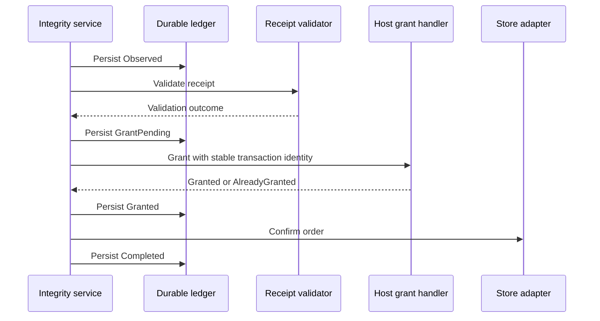

# Adopt the IAP package

Use when composing `com.hung.services.iap` into a host game. API overview: [package README](../../README.md). Package installation and a purchase UI consumer do not establish runtime composition.

## Compose the integrity service

The host composition root supplies the `PurchaseIntegrityService` constructor seams:

- `IPurchaseCatalogProvider`: logical products and platform store-ID mappings.
- `IPurchaseStoreAdapter`: the chosen platform store integration.
- `IPurchaseValidator`: a real receipt-validation backend for supported platforms.
- `IPurchaseLedger`: durable, fail-closed transaction persistence.
- `IPurchaseGrantHandler`: host-owned durable entitlement or economy grants.
- `IPurchaseDiagnostics`: optional minimal diagnostics without raw receipts or credentials.

Connect the service with `ConnectAsync`, publish it through the host's purchase boundary before shop access, and reconcile interrupted/redelivered transactions with `ReconcileAsync`. Disable purchasing on composition failure or unsupported platforms. Never replace missing receipt validation with an always-valid implementation.

## Make the grant durable before confirmation

Use stable store transaction identity as the host grant marker. Persist the marker and grant before returning success. On retry, return `AlreadyGranted` when the durable grant already exists. Do not grant again in the UI after a completed integrity result if the grant handler already owns that reward.

## Recovery and authority

Before grant, redelivery validates and retries the grant. `GrantPending` requires the host's durable marker to detect a committed grant. `Granted` retries confirmation; `Completed` must not grant again. Damaged ledger state fails closed rather than silently resetting purchase evidence.

Local validation and integrity protection are tamper evidence, not server authority. Where server authority is required, validate platform receipts server-side, uniquely record transaction identity, commit the entitlement, and confirm only after the authoritative grant. Keep server-specific composition in host documentation.

## Verify adoption

Verify normal runtime service assignment, catalog mapping, grant-handler composition and startup recovery. Test cancellation, rejection, deferred purchases, offline reconnect, restore/redelivery, repeated callbacks, ledger damage and crash windows around each durable transition. Capture current Android/iOS sandbox-player artifacts tied to package version and build. Fake consumer tests alone do not prove real store adoption.
